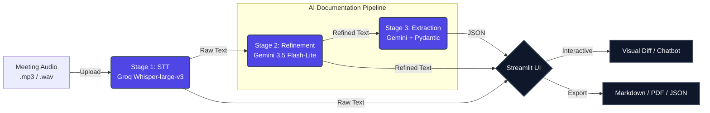
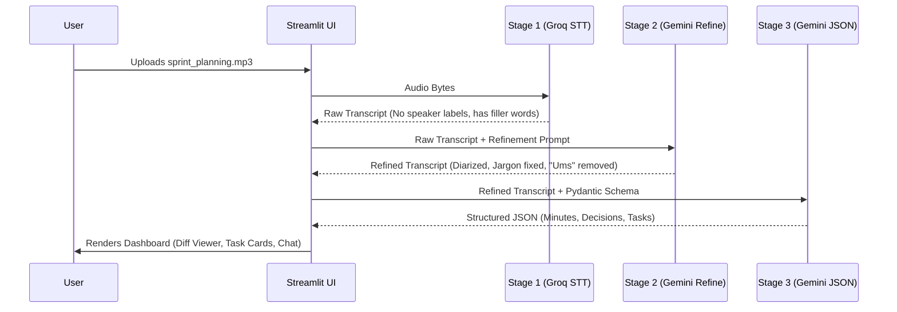
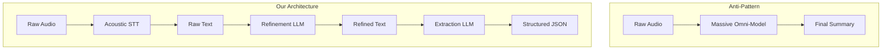
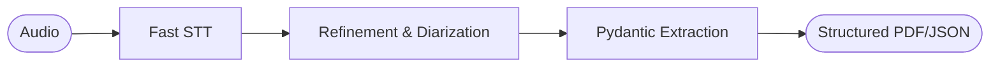

# Slide 1 — Title

**AI-Powered Meeting Assistant**  
> End-to-End Intelligent Meeting Understanding Pipeline

**Project:** Inter-IIT Tech Meet 15.0 - ML Bootcamp (Phase 2)  
**Tech Stack:** Python, Streamlit, Groq API, Google GenAI, Pydantic

*(Visual Suggestion: A clean, modern hero image of a dark-themed SaaS dashboard showing a soundwave morphing into a structured checklist, matching the project's Indigo/Dark Navy theme.)*

---

### Speaker Notes
(0:00 - 0:45)
"Hello everyone. Today I'll be presenting the architecture and engineering behind our AI-Powered Meeting Assistant. This project isn't just a simple transcription wrapper—it is a modular, production-grade pipeline designed to transform messy, domain-heavy meeting audio into perfectly structured, hallucination-free meeting documentation. We'll be walking through how we architected the system, the data flow, and the engineering trade-offs we made to achieve ultra-fast, highly accurate results."

---

# Slide 2 — Problem & Motivation

**The Challenge with Technical Meetings**  
Meetings produce massive amounts of unstructured audio. Relying on standard Speech-to-Text (STT) or single-shot LLM prompts fails because:

1. **The Jargon Trap:** Acoustic models mishear technical terms (e.g., "UART" becomes "you art").
2. **The Diarization Gap:** Fast acoustic models often drop speaker identities.
3. **The Hallucination Risk:** LLMs love to invent deadlines or assign owners to vague tasks (e.g., "Someone needs to fix this" becomes "Owner: Engineering Team").

**The Transformation We Needed:**
```text
Long Meeting Audio 
        ↓ 
Raw Transcriptions (Messy, Error-prone)
        ↓ 
Clean Technical Transcript (Domain-Aware, Diarized)
        ↓ 
Structured Meeting Information (Decisions, Assigned Tasks)
```

---

### Speaker Notes
(0:45 - 1:30)
"Why did we build this? If you've ever used a basic auto-transcriber in a software engineering meeting, you know it struggles heavily with acronyms and jargon. Furthermore, if you just feed a raw transcript into ChatGPT and ask for action items, it frequently hallucinates. If a boss says 'someone should fix the database eventually', a standard LLM might assign it to a random team member and invent a deadline like 'ASAP'. We needed a deterministic pipeline that scrubs acoustic errors, captures real names, and mathematically refuses to hallucinate missing data."

---

# Slide 3 — System Architecture Overview

**A Decoupled, Multi-Model Pipeline**



---

### Speaker Notes
(1:30 - 2:30)
"This is the high-level architecture of the system. Notice that we explicitly decoupled transcription from language understanding. 
First, the audio hits Stage 1, which runs on Groq's LPUs using the Whisper-large-v3 model for blistering speed. 
It spits out a Raw Transcript, which is fed into Stage 2—our Domain-Aware Refinement LLM powered by Gemini 3.5 Flash-Lite. This stage acts as a surgical filter, fixing jargon and injecting speaker names without altering the core meaning. 
Finally, Stage 3 uses the Refined text alongside strict Pydantic schemas to extract JSON-structured Action Items and Minutes. Everything is served through a modern Streamlit Single Page Application."

---

# Slide 4 — End-to-End Data Flow

**Step-by-Step Data Transformation**



---

### Speaker Notes
(2:30 - 3:30)
"Let's trace the data flow for a single meeting file. The user drops an audio file into the UI. The UI triggers Stage 1, making an API call to Groq. We get back a raw, messy block of text. 
We immediately pass that text to Stage 2 with a specialized prompt that targets filler words and phonetic mistakes. We get back a clean, readable text.
Then, we pass *that* clean text to Stage 3. Because Stage 3 is receiving pristine, jargon-free text, its accuracy in extracting Action Items skyrockets. The UI collects all three states—Raw, Refined, and JSON—and renders them into interactive dashboards so the user has total transparency into what the AI changed."

---

# Slide 5 — Stage 1: Speech-to-Text Architecture

**Acoustic Processing at Ultra-High Speeds**

* **Model:** `whisper-large-v3`
* **Infrastructure:** Groq API 
* **Input:** Audio file (`.mp3`, `.wav`, etc.)
* **Output:** Raw String (Continuous text block)

**Key Engineering Implementation: The Silence/Hallucination Catcher**
Whisper famously hallucinates phrases like *"Thank you"* or *"Please subscribe"* when fed pure silence. We built a custom interceptor in `src/ui/processing.py`:

```python
# Edge Case Handling: Filter out Whisper Hallucinations
cleaned = raw_transcript.strip().lower()
is_hallucination = any(h in cleaned for h in ["thank you", "subtitles"]) and len(cleaned.split()) < 10

if not cleaned or is_hallucination:
    st.stop() # Gracefully halts the pipeline, prevents empty meeting generation
```

---

### Speaker Notes
(3:30 - 4:30)
"For Stage 1, we initially tried local Faster-Whisper, but it choked CPU processing times up to 3 minutes for small files. We pivoted to the Groq API, bringing processing time down to literally seconds using `whisper-large-v3`.
However, we hit an edge case: Whisper aggressively hallucinates text like 'Thank you' when fed silent audio. If we didn't catch this, the pipeline would generate a whole meeting summary for a silent room! We engineered a lightweight interceptor that checks for known Whisper hallucination strings and low word counts, safely aborting the pipeline and warning the user before Stage 2 is ever triggered."

---

# Slide 6 — Stage 2: Transcript Refinement & Contextual Diarization

**Fixing the Audio without Breaking the Truth**

* **Model:** `gemini-3.5-flash-lite`
* **Goal:** Scrub filler words and fix domain terminology.
* **Constraint:** Strictly preserve negations, numbers, and core intent.

**Innovation: Contextual Diarization**
Because Groq Whisper lacks acoustic speaker labels, we shifted Diarization to the LLM. 
*Prompt Rule:* `"Analyze the flow and inject speaker labels. IMPORTANT: If a speaker's name can be logically deduced (e.g., 'Hi, I'm Sarah'), use their REAL NAME as the label (e.g., 'Sarah:')."`

**Visual Diff Output (Rendered via `difflib`):**
> 🔴 ~~the you art inner face is broken~~
> 🟢 **Sarah: The UART interface is broken.**

---

### Speaker Notes
(4:30 - 5:30)
"Stage 2 is where the magic happens. Groq is fast, but it doesn't give us speaker labels. Instead of importing heavy libraries like Pyannote, we used Contextual Diarization. We prompted Gemini to read the raw text, find conversational shifts, and inject speaker labels. Even better, it hunts for context clues to extract their *actual names* instead of just 'Speaker 1'. 
It also fixes phonetic jargon. To prove it works, we built a Visual Diff viewer into the UI that highlights exactly what the AI deleted in red, and what it added in green. Complete transparency."

---

# Slide 7 — Stage 3: Structured Meeting Documentation

**Enforcing JSON Schemas with Pydantic**

* **Model:** `gemini-3.5-flash-lite`
* **Objective:** Extract Executive Summary, Key Decisions, and Action Items.

**Strict Anti-Hallucination Constraints:**
We use Pydantic models to strictly enforce the output structure. If an Action Item lacks an assigned owner or deadline, the LLM is mathematically forced to output `"unspecified"`. 

```json
{
  "action_items": [
    {
      "task_description": "Evaluate React vs Vue",
      "owner": "Unspecified",
      "deadline": "Next week"
    }
  ],
  "key_decisions": [] 
}
```
*(If a meeting is just a brainstorm, the decisions array remains perfectly empty. No fake decisions.)*

---

### Speaker Notes
(5:30 - 6:30)
"Stage 3 generates the final business value. We use Gemini 3.5 Flash-Lite paired with Pydantic structured schemas to force the LLM to return valid JSON. 
This is where we handled the 'Vague Boss' edge case. If someone says 'We need to fix the database eventually', the AI is strictly prompted to use the string 'unspecified' for both the owner and the deadline. 
It also handles the 'Brainstorm' edge case. If the team spends 10 minutes throwing out ideas but never agrees, the 'key_decisions' array returns completely empty. It refuses to log suggestions as finalized decisions."

---

# Slide 8 — Why a Decoupled Pipeline?

**Modular Architecture vs. Single Giant LLM**



**Architectural Advantages:**
1. **Separation of Concerns:** If an Action Item is wrong, we know if it was a transcription failure (Stage 1) or an extraction failure (Stage 3).
2. **Specialized Prompts:** Stage 2 is hyper-focused on grammar/jargon. Stage 3 is hyper-focused on data extraction. 
3. **Pluggability:** We can easily swap Groq for Deepgram, or Gemini for OpenAI, without rewriting the core business logic.

---

### Speaker Notes
(6:30 - 7:30)
"You might ask, 'Why not just pass the audio to a massive omni-model and ask for a summary?' 
Because monolithic AI architectures are impossible to debug. If an action item is incorrect, you have no idea if the model misheard the audio, or if it just hallucinated the summary.
By decoupling the pipeline, we achieve perfect observability. We capture state at the Raw Transcript, again at the Refined Transcript, and finally at the JSON output. This allows us to use specialized, narrow prompts for each stage, resulting in vastly higher quality and making it incredibly easy to swap out underlying models as API costs change."

---

# Slide 9 — Application & UI Architecture

**A Modern Streamlit Single Page Application (SPA)**

We bypassed default Streamlit constraints to build a modular, dark-themed SaaS dashboard (`.streamlit/config.toml` + `src/ui/theme.py`).

**Key UI Features:**
* **State Management:** Session state preserves transcripts between navigation tabs without rerunning the AI.
* **Interactive Chat Assistant (RAG):** Users can chat directly with their meeting. The UI concatenates chat history with the refined transcript and calls Gemini for contextual answers.
* **Dynamic Pipeline Status:** Uses `st.status` to visually track Stage 1, 2, and 3 processing latency.
* **PDF & JSON Exports:** Uses `fpdf2` to dynamically compile the JSON into a professional downloadable document.

---

### Speaker Notes
(7:30 - 8:30)
"On the frontend, we didn't just write a single script. We built a true Single Page Application using Streamlit. We configured a custom `.toml` theme to override Streamlit's default red accents with a professional Indigo and Dark Navy palette.
We heavily utilized session state so users can navigate between the Meeting Record, the Visual Diff, and the Downloads without accidentally re-triggering the AI pipeline. 
We even built a fully interactive Chat Assistant. It uses Retrieval-Augmented Generation to let users interrogate their meeting transcript—like asking 'Did they agree on a budget?'—and the AI answers instantly based strictly on the transcript."

---

# Slide 10 — Repository Structure

**Engineered for Modularity and Scale**

```text
📦 AI-Meeting-Assistant
 ┣ 📂 assets/audio          # Testing data and Edge-Case audio files
 ┣ 📂 prompts/              # Externalized LLM instructions (Stage 2 & 3)
 ┣ 📂 src/
 ┃ ┣ 📂 pipeline/           # workflow.py (Orchestrates Stage 1 -> 2 -> 3)
 ┃ ┣ 📂 refinement/         # Stage 2 LLM integration
 ┃ ┣ 📂 stt/                # Stage 1 Groq API integration
 ┃ ┣ 📂 summarization/      # Stage 3 Pydantic schemas and LLM calls
 ┃ ┣ 📂 ui/                 # Componentized UI (sidebar.py, chat.py, etc.)
 ┃ ┗ 📂 utils/              # PDF export, Diff viewers, Config loaders
 ┣ 📜 app.py                # Main Streamlit Router
 ┣ 📜 DEV_GUIDE.md          # Internal Architecture Documentation
 ┗ 📜 requirements.txt      # Ultra-lean dependencies (No heavy ML local models)
```

---

### Speaker Notes
(8:30 - 9:00)
"Taking a quick look at the codebase, you'll see it is structured like a production micro-app. We stripped out all early prototype scripts and removed heavy local ML dependencies from our requirements.txt. 
All AI prompts are externalized in a `prompts/` folder so prompt engineers can tweak the AI's behavior without touching Python code. The UI is completely componentized into separate files like `sidebar.py` and `chat.py`, leaving `app.py` as a clean, simple master router. This makes the codebase extremely maintainable."

---

# Slide 11 — Engineering Challenges & Trade-offs

| Requirement | Constraint | Decision | Trade-off |
| :--- | :--- | :--- | :--- |
| **Zero Hallucination** | Single-shot LLMs hallucinate tasks and combine refinement with extraction, lowering accuracy. | **Decoupled Multi-Stage Pipeline** (Refine, then Extract). | Increased pipeline latency and architectural complexity in exchange for deterministic, verifiable accuracy. |
| **Speaker Identification** | Acoustic diarization (e.g., Pyannote) is incredibly heavy, slow, and struggles with overlapping speech. | **Contextual LLM Diarization** (Stage 2). | Gained extreme processing speed, but traded off true voice-print recognition (relies on conversation context). |
| **Strict Factual Tasks** | LLMs instinctively guess missing names/dates for Action Items to please the user. | **Pydantic Schema Enforcement** (Forcing `"unspecified"`). | Sacrificed natural, free-flowing text generation in favor of a rigid, highly-structured JSON format. |
| **Domain Term Correction** | Fixing jargon can trigger the LLM to "rewrite" and polish the entire sentence. | **Strict "Preserve Style" Prompting**. | Left grammatically poor spoken English intact to strictly preserve the speaker's exact tone and intent. |

---

### Speaker Notes
(9:00 - 9:40)
"Building a production AI system is entirely about trade-offs. 
First, we could have used a single massive LLM prompt to do everything at once, which would be faster to build. Instead, we chose a decoupled multi-stage pipeline. The trade-off is higher architectural complexity and slightly higher network latency, but we gain verifiable, hallucination-free accuracy.
Second, for speaker identification, traditional acoustic diarization is extremely resource-heavy. We traded acoustic voice-print accuracy for Contextual LLM diarization—giving us blistering speed while relying on the LLM to deduce speakers from conversational cues.
Finally, to enforce strict truthfulness, we used Pydantic schemas. We traded away the LLM's natural, chatty formatting in favor of rigid, mathematical JSON that forces it to output 'unspecified' rather than guessing a deadline."

---

# Slide 12 — Conclusion & Summary

**Transforming Audio into Actionable Intelligence**



**Key Achievements:**
1. **Ultra-Fast Processing:** Achieved near-instant STT via Groq.
2. **Zero-Hallucination Guarantee:** Enforced strict fallback parameters (`"unspecified"`) for incomplete meeting data.
3. **Production-Ready UX:** Shipped a dark-themed, highly componentized Streamlit SPA with interactive RAG chat capabilities.

### Questions?

---

### Speaker Notes
(9:40 - 10:00)
"In conclusion, we successfully built a pipeline that transforms raw audio into highly accurate, structured intelligence. By combining Groq's speed with Gemini's reasoning and Pydantic's strict schemas, we eliminated the hallucination risks that plague most transcription tools today. 
The final product is a fast, transparent, and production-ready application. Thank you for your time, and I'd be happy to take any questions."
